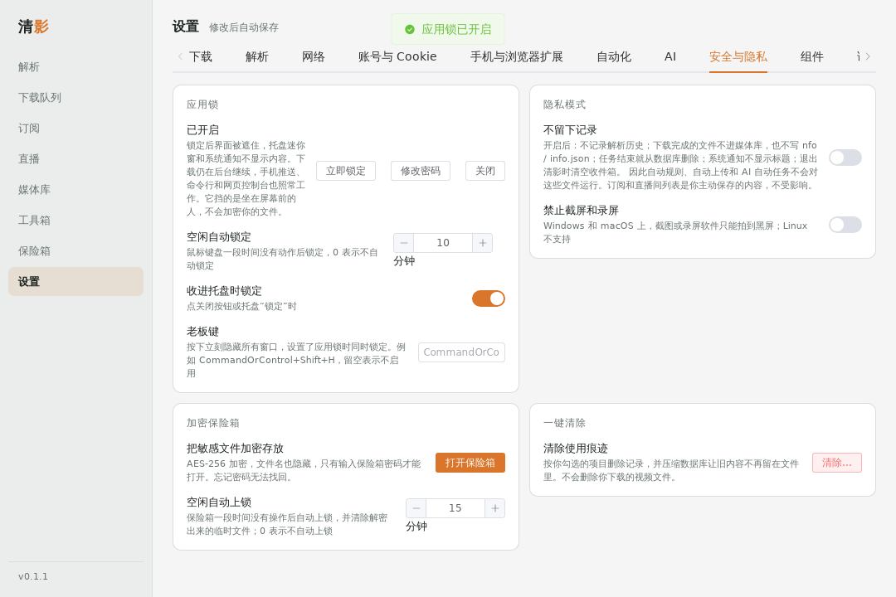
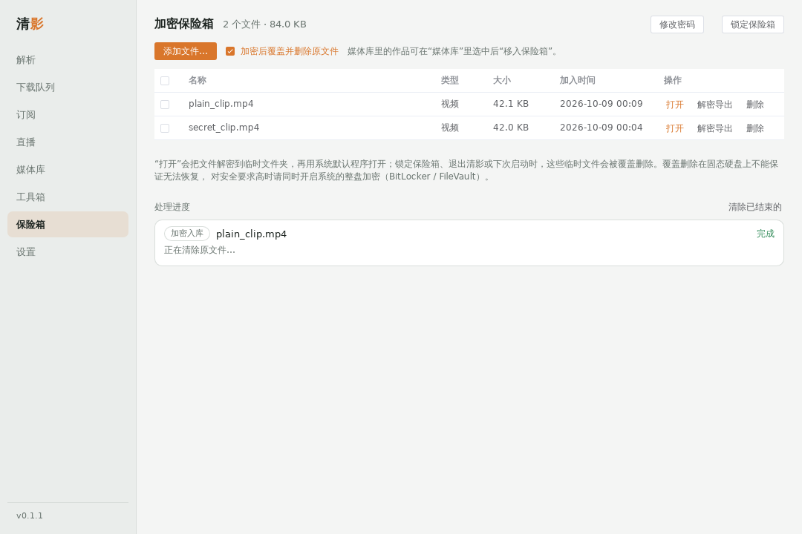

# 清影 ClearClip（桌面版）

把本仓库的短视频去水印解析做成的桌面程序：内置抖音、快手、小红书、B站、微博、Pixiv 解析，其他网站通过 yt-dlp（上千个视频网站）和网页嗅探支持。基于 Tauri 2 + Vue 3 + Rust，支持 Windows、macOS、Linux。

规划与设计参考见 [`docs/desktop-plan.md`](../docs/desktop-plan.md)。

| 解析 | 图集选择 |
| --- | --- |
|  |  |
| **下载队列** | **设置** |
|  |  |

| 内置播放器（字幕跳转） | 命令面板（Ctrl+K） |
| --- | --- |
|  |  |
| **安全与隐私** | **加密保险箱** |
|  |  |

## 功能

- 粘贴整段分享文案即可解析，自动提取链接；一次粘贴多条链接可批量下载
- 支持平台：

  | 平台 | 内容 | 解析方式 |
  | --- | --- | --- |
  | 抖音 | 视频、图集、背景音乐 | 分享页 `window._ROUTER_DATA` |
  | 快手 | 视频、图集、背景音乐 | 分享页 `window.INIT_STATE`，回退 `rest/wd/photo/info` |
  | 小红书 | 视频笔记、图文笔记（无水印原图） | 笔记页 `window.__INITIAL_STATE__` |
  | B站 | 视频（含多 P，按链接 `?p=` 选择），全部清晰度与编码、杜比 / Hi-Res 音轨 | `x/web-interface/view` + wbi 签名的 `x/player/wbi/playurl`（DASH 分轨，下载后合并）；失败时退回 html5 MP4 |
  | 微博 | 视频、图片（转发微博取原微博媒体） | `m.weibo.cn/statuses/show` |
  | Pixiv | 插画 / 漫画多页原图、动图（合成为 MP4 / WebM / GIF） | `ajax/illust`、`pages`、`ugoira_meta`；R-18 需要登录 |
  | 其他网站 | YouTube、Pornhub、Twitter/X、TikTok 等 | yt-dlp（在“设置 → 组件”中一键安装）；还不行时在网页里查找 mp4 / m3u8 地址 |

- 内置解析器失效时自动用 yt-dlp 重试；番剧、用户主页等内置解析器不支持的链接也交给 yt-dlp
- 播放列表 / 合集：勾选条目后逐条解析并下载，按“列表名 / 第 N 集”归档（模板可改）
- 清晰度预设（最高、不超过 1080P、省空间、只要音频），同等清晰度优先 H.264；可只保留音频（MP3 / M4A / Opus / FLAC）
- m3u8：AES-128 解密、分片并发与续传、插播广告过滤，下载后无损转为 MP4；DRM 和直播流会明确提示
- 组件管理：yt-dlp、ffmpeg 首次使用时从 GitHub 官方发布页下载并校验 SHA-256，可填 GitHub 镜像、回退上一版本或导入本地文件

- 可单独下载背景音乐、封面
- 下载队列：并发数可调、按网站限制并发、大文件分段并行、暂停 / 继续（断点续传，重启程序后也能继续）、网络错误自动重试、直链过期自动重新解析、全局限速
- 网络分流：按网站选择直连、系统代理或自定义 HTTP / SOCKS 代理（国内平台默认直连，海外网站默认走系统代理）
- 剪贴板监听：复制链接后自动识别（默认只识别内置平台和常用网站，可改为识别所有网址）；主窗口不在前台时，右下角弹出迷你窗
- 手机发链接到电脑：同一 Wi-Fi 下扫码打开网页粘贴发送，或用 iPhone 快捷指令 / Android HTTP Shortcuts 加入分享菜单；新设备需在电脑上确认配对（[设置说明](../docs/phone-send.md)）
- 拖入链接文本或 .txt 文件批量导入
- 队列：在任务的“更多”菜单里置顶 / 调整顺序、定时开始；全部完成后打开文件夹、睡眠或关机；下载时阻止系统休眠；可在每个任务完成后运行自定义命令
- 整理：把标题、作者、封面写入视频 / 音频文件；可选保存信息 JSON 和 Jellyfin / Plex 用的 NFO 文件
- 设置里可一键检查各平台解析是否正常（健康检查）
- 订阅与追更（默认关闭）：订阅 YouTube 频道 / 播放列表、B站 UP 主、Pixiv 画师、抖音用户主页或任意 yt-dlp 能列出条目的列表，定期检查并自动下载新内容；每个订阅可设检查间隔、首次订阅策略、关键词 / 时长 / 发布时间过滤、清晰度、保存位置和命名；连续失败自动暂停；可开机自启在托盘运行
- 直播录制：添加直播间后自动监控开播并录制（B站、抖音、快手、虎牙原生；斗鱼、YouTube、Twitch 等走 yt-dlp；也可直接填直播流地址）；FLV / TS 不转码、自动分段、断流重连、磁盘保护，录完可转 MP4 并合并分段
- 收到的链接（“媒体库 → 收到的链接”）：剪贴板识别、手机和浏览器扩展发来的链接、手动解析失败的链接都会记录下来（重启后仍在），可按来源 / 状态筛选、搜索，一键重试、忽略；播放列表提示去选择条目；需要登录的失败链接显示“登录 XX”，登录保存后自动重试；可设保留天数和条数
- 账号与登录：每个网站有登录说明（不登录能做什么、什么时候需要、推荐方式，见 [login-guide.md](../docs/login-guide.md)）；内置登录窗口对常见网站自动识别登录完成；账号显示登录是否有效并定期检查，失效时通知并给出“重新登录”
- 浏览器扩展“发送到清影”（[`extension/`](./extension/)）：网页右键发送链接，一键同步当前网站的登录 Cookie，可对勾选的网站在登录状态变化时自动同步；弹窗显示与清影的连接状态
- 字幕与弹幕：人工字幕、YouTube 自动生成字幕和偏好语言的自动翻译、B站 CC / AI 字幕和弹幕；VTT 转 SRT（自动字幕的滚动重复会整理）、弹幕转 ASS；可以单独保存、内嵌到视频或烧录进画面；偏好语言决定排序和自动选择（[说明](../docs/subtitles-and-clips.md)）
- 片段与章节：只下载视频的一段（可精确到帧），字幕同步裁剪；有章节的视频可以另存为每章一个文件
- 播放列表：条目带封面和时长，标出已下载的，可搜索、反选、只选没下载过的、按序号选范围
- 下载后用 ffmpeg 检查文件，损坏时自动重新下载一次
- 图集合成视频：选中的图片按设定时长合成 MP4，可配背景音乐
- 全局快捷键（默认 `Ctrl+Shift+D`）解析剪贴板；关闭窗口后驻留系统托盘
- 媒体库：已下载文件和解析历史；本地封面缓存、列表 / 网格视图，按平台、类型、时间筛选；文件被移动或删除时可一键重新下载；上千条记录也不卡；已下载过的内容自动跳过
- 文件命名模板：`{author}` `{title}` `{date}` `{id}` `{platform}`
- 账号与 Cookie：内置登录窗口、导入 cookies.txt 或粘贴；同一网站可保存多个账号；Cookie 加密保存，只发给对应网站
- 远程 API 模式：可继续使用已部署的旧版 `jxindex.php`（仅抖音、快手），也可作为本地解析失败时的备用
- 首次启动免责声明；通过 GitHub Releases 检查新版本

**媒体库与工具**（[说明](../docs/library-and-tools.md)）

- 媒体库：标签、收藏、评分、备注，多条件筛选和排序；导入已有文件夹；回收站；按模板整理文件夹；重复文件检测（内容相同 / 画面相似）；磁盘占用统计；字幕全文搜索并跳到播放位置；视频预览图和镜头检测；导出 CSV / JSON；备份与还原
- 内置播放器：自动加载同名字幕、点字幕跳转、倍速；打不开时给出错误码和替代办法
- 工具箱：压缩、转 GIF、竖屏转横屏、倍速、响度标准化、旋转翻转、拼接、截图、转封装 / 转 MP4 / 提取音频、裁剪片段、写入章节；字幕偏移 / 帧率换算 / 双语合并 / 整理 / 格式互转；音频标签；弹幕样式
- 按大小上限自动选清晰度；下载失败自动降一档重试
- 剪辑（[说明](../docs/video-edit.md)）：工具箱里的时间线剪辑——多段视频 / 图片按顺序排列，拖动裁剪、分割、调整顺序，调速度 / 音量 / 画面方向 / 亮度对比度饱和度，16 种转场，文字（可在画面里拖动），配乐（有人声时自动压低），低分辨率预览后再导出 MP4 / MKV；工程可保存成 `.ccedit`，有撤回 / 重做和自动草稿；还有“区域”——框出镜头里的一个物体，程序持续追踪它的位置，让马赛克 / 模糊 / 局部调色或取景跟着它走，追偏了可以用手动点校正
- LUT 工作室（[说明](../docs/lut-studio.md)）：用示例图片边看边调，生成新的 `.cube` 3D LUT——基础调色、叠加别人的 LUT 继续调、参考一张图片的色调，预览与 ffmpeg 一致，可导出调整后的图片或直接用于视频规整
- 视频规整（[说明](../docs/video-normalize.md)）：把手机录屏、直播录制、平台下载的成片统一成同一规格——一键预设、可变帧率转固定、HDR 转 SDR、色彩标记修正、自动色阶、`.cube` LUT 调色、自动去黑边、响度统一、防抖；镜头之间偏色 / 亮度 / 饱和度不一致时自动校正，也可以按镜头单独调节（分段色彩匹配）；输出电平 16–235 / 0–255 可选；降噪四档；可批量，也能接进自动规则和直播录制；没有 x264 / zscale / vidstab 的精简版 ffmpeg 下有内置兜底，也可以在设置里换成完整版
- AI（可选）：语音转文字（在线接口或本机 whisper.cpp）、LLM 字幕翻译与双语字幕、摘要与章节

**自动化与集成**（[说明](../docs/automation.md)）

- 自动规则（按平台 / 作者 / 标题 / 类型 / 来源 / 大小匹配 → 加标签、收藏、移动、提取音频、上传、通知）；自动上传到 WebDAV 或另一个文件夹
- 通知推送：Webhook、Telegram、Bark、Server酱、企业微信 / 钉钉 / 飞书群机器人、ntfy
- 自定义站点规则（正则取视频地址）；播客 RSS；浏览器扩展嗅探页面里的视频
- HTTP 接口 `/api/v1`、局域网网页控制台、命令行 `clearclip add / list / pause …`
- 订阅保留策略；直播预约时段

**网络与桌面体验**（[说明](../docs/desktop-experience.md)）

- 限速计划（按星期和时段）、省流量模式、线路测速并一键设为某网站的出口
- 首次引导、命令面板（Ctrl+K）、悬浮拖拽窗、任务详情（原始请求和过程记录）、托盘显示总速度、中文 / English 界面

**安全与隐私**（[说明](../docs/security-and-privacy.md)）

- 应用锁（空闲自动锁、老板键）、隐私模式、加密保险箱（AES-256-GCM）、一键清除、禁止截屏

## 开发

需要 Node.js 20+、Rust 1.80+，以及 [Tauri 的系统依赖](https://tauri.app/start/prerequisites/)（Linux 需要 `libwebkit2gtk-4.1-dev` 等）。

```bash
cd desktop
npm install
npm run tauri dev      # 开发模式
npm run tauri build    # 打包安装包，产物在 src-tauri/target/release/bundle/
```

检查：

```bash
npm run build                                   # 前端类型检查 + 构建
npm run i18n                                    # 列出还没有英文译文的界面文字
cd src-tauri
cargo fmt --check
cargo clippy --all-targets -- -D warnings
cargo test                                      # 解析器、下载器、数据库、命名规则的单元测试
```

## 发布

在 GitHub 的 Actions 页面手动运行 `desktop-release`（选 `main` 分支），或推送 `desktop-v*` 标签（例如 `desktop-v0.2.0`），`.github/workflows/desktop-release.yml` 会构建 Windows x64（msi / nsis、便携版 zip）、Windows ARM64（nsis、便携版 zip，实验性：失败不影响其它平台）、macOS（Apple 芯片和 Intel 通用的一个 dmg）、Linux（AppImage / deb / rpm）和浏览器扩展 zip，并发布 Release。`desktop-ci` 会在每次提交时对 macOS 两个架构和 Windows ARM64 做编译检查。发布前先把 `tauri.conf.json`、`Cargo.toml`、`package.json` 的版本号改成一致，并在 `CHANGELOG.md` 里补上这一版的内容。

更新签名密钥、macOS / Windows 代码签名和扩展上架的完整步骤见 [docs/release-guide/](../docs/release-guide/README.md)。

macOS 签名和公证需要在仓库 Secrets 中配置 `APPLE_CERTIFICATE`、`APPLE_CERTIFICATE_PASSWORD`、`APPLE_SIGNING_IDENTITY`、`APPLE_ID`、`APPLE_PASSWORD`、`APPLE_TEAM_ID`。不配置时生成未签名的安装包。

### 程序内更新

在仓库 Secrets 中配置 `TAURI_SIGNING_PRIVATE_KEY`（可选 `TAURI_SIGNING_PRIVATE_KEY_PASSWORD`）和对应公钥 `TAURI_UPDATER_PUBKEY`（用 `npx tauri signer generate` 生成）后，发布流程会生成签名更新包和 `latest.json`，程序里“检查更新”可直接下载安装并重启。未配置时只提示前往发布页下载。

### 包管理器

[`packaging/`](./packaging/) 里有 winget、Scoop、Homebrew 的清单模板，发布后运行 `python3 packaging/update-manifests.py <版本>` 生成带校验值的清单。

## 目录结构

```
desktop/
├── extension/                 # 浏览器扩展“发送到清影”
├── packaging/                 # winget / Scoop / Homebrew 清单
├── src/                       # Vue 3 前端
│   ├── App.vue                # 主窗口：侧边导航 + 四个页面
│   ├── MiniApp.vue            # 托盘迷你窗（index.html#mini）
│   ├── views/                 # 解析 / 下载队列 / 媒体库 / 设置
│   ├── stores/app.ts          # Pinia：设置、队列、解析状态
│   └── api/index.ts           # Tauri 命令与事件封装
└── src-tauri/src/
    ├── providers/             # 解析器：douyin kuaishou xiaohongshu bilibili weibo pixiv remote，
    │                          #   ytdlp（通用）、generic（网页嗅探）
    ├── engine/                # 下载引擎：http（分段并行、续传）、hls（m3u8）
    ├── download.rs            # 下载队列、合并与后处理调度
    ├── postprocess.rs         # ffmpeg：合并、转封装、提取音频、动图合成
    ├── tools.rs               # yt-dlp / ffmpeg 组件管理
    ├── quality.rs             # 清晰度预设
    ├── cookies.rs secret.rs   # 加密 Cookie 存储
    ├── net.rs                 # 按网站分流、限速
    ├── phone.rs               # 手机发链接（局域网网页服务）、扩展 Cookie 同步接口
    ├── inbox.rs               # 收到的链接：记录、状态跟随、重试、登录后自动重试
    ├── subs.rs                # 订阅：调度、检查、去重、过滤
    ├── live.rs                # 直播录制：监控、录制、分段、重连、录后处理
    │   providers/live.rs      #   各平台开播检测与直播流
    │   providers/listing.rs   #   各平台“最新条目”列表
    ├── organize.rs            # 元数据、信息 JSON、NFO
    ├── power.rs               # 阻止休眠、完成后睡眠 / 关机
    ├── library*.rs            # 媒体库：整理、导入、回收站、重复检测、字幕索引、预览图（library_cmds / library_media）
    ├── media_tools.rs         # 后台任务系统 + 工具箱的 ffmpeg 处理（media_cmds、subtitle_tools）
    ├── ai.rs                  # 语音转文字、字幕翻译、摘要与章节
    ├── rules.rs notify.rs upload.rs   # 自动规则、通知推送、自动上传
    ├── api.rs console.rs cli.rs       # HTTP 接口 v1、网页控制台、命令行
    ├── security.rs            # 应用锁、老板键、隐私模式清理、一键清除
    ├── safebox.rs             # 加密保险箱（Argon2id + 分块 AES-256-GCM）
    ├── vault.rs               # 加密保存 API 密钥等小密钥
    ├── player.rs media_server.rs      # 内置播放器：字幕查找、本机 Range 媒体服务
    ├── backup.rs              # 备份与还原
    ├── i18n.rs                # 托盘菜单、通知标题的英文（界面文字的翻译在前端 src/i18n）
    ├── db.rs                  # SQLite：历史与媒体库
    ├── naming.rs              # 文件命名
    ├── settings.rs            # 设置（JSON）
    ├── clipboard.rs           # 剪贴板监听
    ├── tray.rs                # 托盘、迷你窗
    └── commands.rs            # 前端可调用的命令
```

新增平台：在 `providers/` 下新建文件实现 `Provider` trait（`matches` / `resolve` / `referer`），并在 `providers::all()` 中注册。

## 数据位置

设置、数据库保存在系统的应用数据目录（标识 `com.dixuanaoyi.clearclip`），例如：

- Windows：`%APPDATA%\com.dixuanaoyi.clearclip\`
- macOS：`~/Library/Application Support/com.dixuanaoyi.clearclip/`
- Linux：`~/.config/com.dixuanaoyi.clearclip/` 与 `~/.local/share/com.dixuanaoyi.clearclip/`

默认下载到系统“下载”文件夹下的 `ClearClip` 目录。

**便携版**：程序目录下存在 `portable` 文件（或 `data` 目录）时，设置、数据库、Cookie 和日志都保存在程序目录的 `data` 文件夹。发布页提供 Windows 便携版 zip（需要系统自带的 WebView2 运行时，Windows 10/11 一般已安装）。

## 已知限制

- 各平台解析依赖公开页面或接口，平台调整后需要更新对应解析器（抖音、快手可先切换到远程 API 模式；其他平台失效时会自动用 yt-dlp 重试）。
- 小红书网页链接通常需要带 `xsec_token`，部分笔记、微博需要先在设置中登录。
- B站未登录一般最高 480P / 720P，登录后 1080P，大会员清晰度需要大会员账号；付费内容不支持。
- yt-dlp 和 ffmpeg 需要在“设置 → 组件”中安装（或使用系统已安装的版本）。macOS 不提供 ffmpeg 自动下载，请用 Homebrew 安装后导入。自动下载的 ffmpeg 为 LGPL 版本，不含 x264，Pixiv 动图会合成为 WebM。
- DRM 加密内容不支持下载。直播流请用“直播”页面录制。
- 单元测试使用按页面结构编写的样本数据（`src-tauri/tests/fixtures/`），不访问线上。

### 没有做的

下面这些我评估后没有做，或做不了：

- 无界面的 Docker / NAS 版本（需要把下载核心和控制台从桌面外壳里拆出来单独构建）；Flatpak / Snap 打包
- 绕过付费、会员或 DRM 的下载；音乐平台下载
- 人声分离、画面超分辨率、按画面内容的语义搜索（需要体积很大的本地模型）；实时转码、自动切精彩片段
- 评论抓取、整页转 PDF / 长截图
- 指纹等系统生物识别解锁（应用锁用密码）；自动检测计量网络（省流量模式需要手动开）
- 日语界面
- 应用更新签名、代码签名、浏览器扩展上架：需要你自己的密钥和账号，步骤见 [docs/release-guide/](../docs/release-guide/README.md)

## 免责声明

仅用于下载你有权保存的内容。本项目只为学习研究，如涉及侵权请联系删除。
