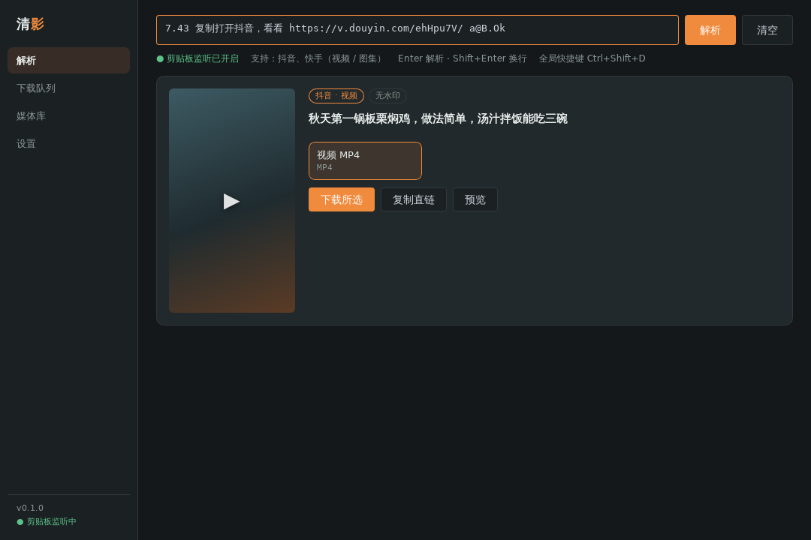
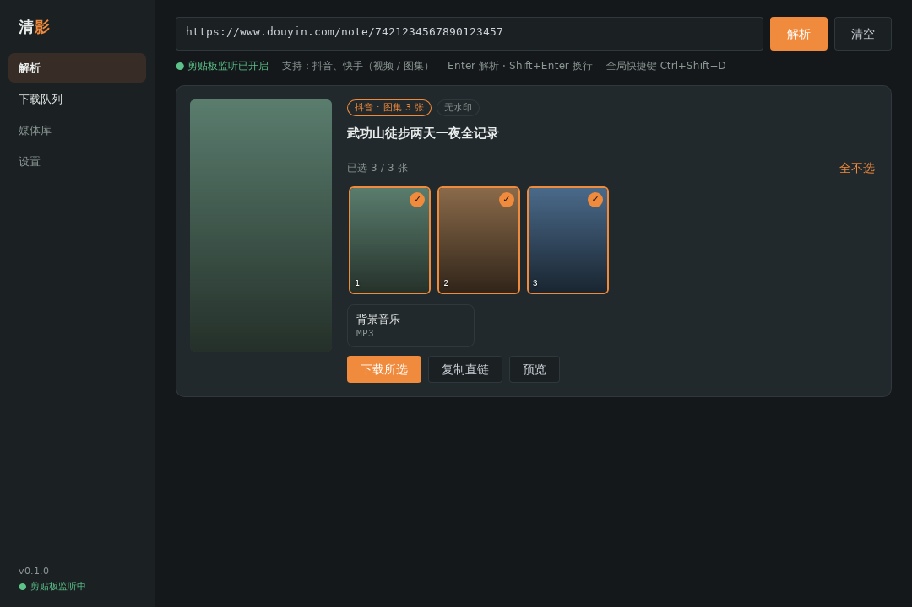
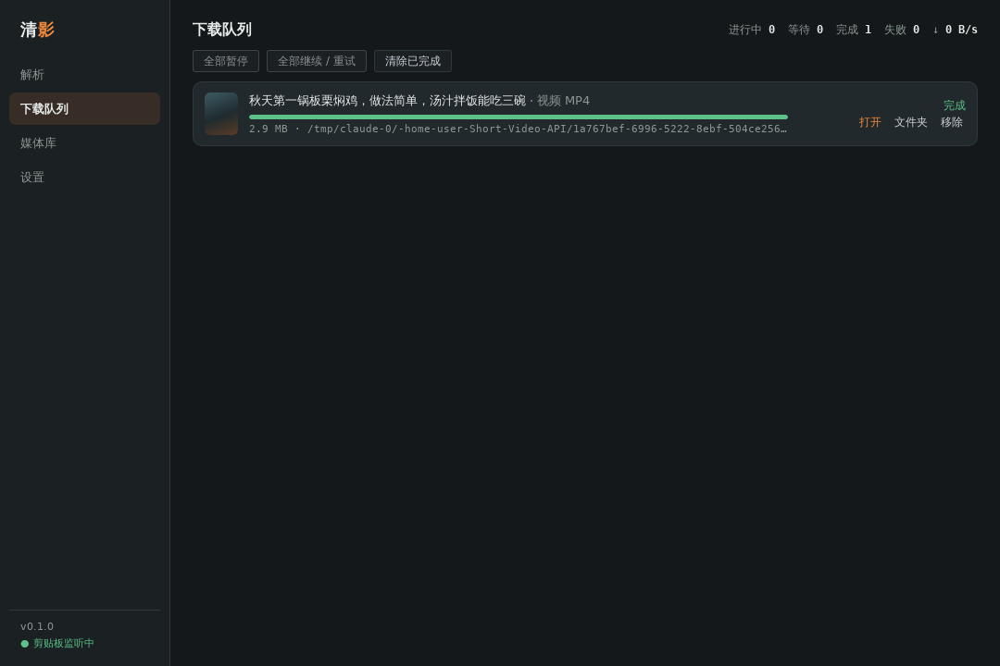
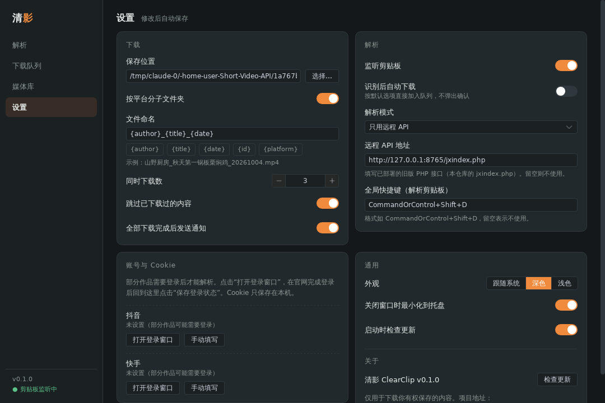

# 清影 ClearClip（桌面版）

把本仓库的短视频去水印解析做成的桌面程序：内置抖音、快手、小红书、B站、微博、Pixiv 解析，其他网站通过 yt-dlp（上千个视频网站）和网页嗅探支持。基于 Tauri 2 + Vue 3 + Rust，支持 Windows、macOS、Linux。

规划与设计参考见 [`docs/desktop-plan.md`](../docs/desktop-plan.md)。

| 解析 | 图集选择 |
| --- | --- |
|  |  |
| **下载队列** | **设置** |
|  |  |

## 功能

- 粘贴整段分享文案即可解析，自动提取链接；一次粘贴多条链接可批量下载
- 支持平台：

  | 平台 | 内容 | 解析方式 |
  | --- | --- | --- |
  | 抖音 | 视频、图集、背景音乐 | 分享页 `window._ROUTER_DATA` |
  | 快手 | 视频、图集、背景音乐 | 分享页 `window.INIT_STATE`，回退 `rest/wd/photo/info` |
  | 小红书 | 视频笔记、图文笔记（无水印原图） | 笔记页 `window.__INITIAL_STATE__` |
  | B站 | 视频（含多 P，按链接 `?p=` 选择），全部清晰度与编码、杜比 / Hi-Res 音轨 | `x/web-interface/view` + wbi 签名的 `x/player/wbi/playurl`（DASH 分轨，下载后合并）；失败时退回 html5 MP4 |
  | 微博 | 视频、图片（转发微博取原微博媒体） | `m.weibo.cn/statuses/show` |
  | Pixiv | 插画 / 漫画多页原图、动图（合成为 MP4 / WebM / GIF） | `ajax/illust`、`pages`、`ugoira_meta`；R-18 需要登录 |
  | 其他网站 | YouTube、Pornhub、Twitter/X、TikTok 等 | yt-dlp（在“设置 → 组件”中一键安装）；还不行时在网页里查找 mp4 / m3u8 地址 |

- 内置解析器失效时自动用 yt-dlp 重试；番剧、用户主页等内置解析器不支持的链接也交给 yt-dlp
- 播放列表 / 合集：勾选条目后逐条解析并下载，按“列表名 / 第 N 集”归档（模板可改）
- 清晰度预设（最高、不超过 1080P、省空间、只要音频），同等清晰度优先 H.264；可只保留音频（MP3 / M4A / Opus / FLAC）
- m3u8：AES-128 解密、分片并发与续传、插播广告过滤，下载后无损转为 MP4；DRM 和直播流会明确提示
- 组件管理：yt-dlp、ffmpeg 首次使用时从 GitHub 官方发布页下载并校验 SHA-256，可填 GitHub 镜像、回退上一版本或导入本地文件

- 可单独下载背景音乐、封面
- 下载队列：并发数可调、按网站限制并发、大文件分段并行、暂停 / 继续（断点续传，重启程序后也能继续）、网络错误自动重试、直链过期自动重新解析、全局限速
- 网络分流：按网站选择直连、系统代理或自定义 HTTP / SOCKS 代理（国内平台默认直连，海外网站默认走系统代理）
- 剪贴板监听：复制链接后自动识别（默认只识别内置平台和常用网站，可改为识别所有网址）；主窗口不在前台时，右下角弹出迷你窗
- 手机发链接到电脑：同一 Wi-Fi 下扫码打开网页粘贴发送，或用 iPhone 快捷指令 / Android HTTP Shortcuts 加入分享菜单；新设备需在电脑上确认配对（[设置说明](../docs/phone-send.md)）
- 拖入链接文本或 .txt 文件批量导入
- 队列：在任务的“更多”菜单里置顶 / 调整顺序、定时开始；全部完成后打开文件夹、睡眠或关机；下载时阻止系统休眠；可在每个任务完成后运行自定义命令
- 整理：把标题、作者、封面写入视频 / 音频文件；可选保存信息 JSON 和 Jellyfin / Plex 用的 NFO 文件
- 设置里可一键检查各平台解析是否正常（健康检查）
- 订阅与追更（默认关闭）：订阅 YouTube 频道 / 播放列表、B站 UP 主、Pixiv 画师、抖音用户主页或任意 yt-dlp 能列出条目的列表，定期检查并自动下载新内容；每个订阅可设检查间隔、首次订阅策略、关键词 / 时长 / 发布时间过滤、清晰度、保存位置和命名；连续失败自动暂停；可开机自启在托盘运行
- 直播录制：添加直播间后自动监控开播并录制（B站、抖音、快手、虎牙原生；斗鱼、YouTube、Twitch 等走 yt-dlp；也可直接填直播流地址）；FLV / TS 不转码、自动分段、断流重连、磁盘保护，录完可转 MP4 并合并分段
- 浏览器扩展“发送到清影”（[`extension/`](./extension/)）：网页右键发送链接，一键同步当前网站的登录 Cookie
- 字幕与弹幕：下载 yt-dlp 提供的各语言字幕（与视频同名，播放器自动加载）、B站弹幕 XML
- 图集合成视频：选中的图片按设定时长合成 MP4，可配背景音乐
- 全局快捷键（默认 `Ctrl+Shift+D`）解析剪贴板；关闭窗口后驻留系统托盘
- 媒体库：已下载文件和解析历史；本地封面缓存、列表 / 网格视图，按平台、类型、时间筛选；文件被移动或删除时可一键重新下载；上千条记录也不卡；已下载过的内容自动跳过
- 文件命名模板：`{author}` `{title}` `{date}` `{id}` `{platform}`
- 账号与 Cookie：内置登录窗口、导入 cookies.txt 或粘贴；同一网站可保存多个账号；Cookie 加密保存，只发给对应网站
- 远程 API 模式：可继续使用已部署的旧版 `jxindex.php`（仅抖音、快手），也可作为本地解析失败时的备用
- 首次启动免责声明；通过 GitHub Releases 检查新版本

## 开发

需要 Node.js 20+、Rust 1.80+，以及 [Tauri 的系统依赖](https://tauri.app/start/prerequisites/)（Linux 需要 `libwebkit2gtk-4.1-dev` 等）。

```bash
cd desktop
npm install
npm run tauri dev      # 开发模式
npm run tauri build    # 打包安装包，产物在 src-tauri/target/release/bundle/
```

检查：

```bash
npm run build                                   # 前端类型检查 + 构建
cd src-tauri
cargo fmt --check
cargo clippy --all-targets -- -D warnings
cargo test                                      # 解析器、下载器、数据库、命名规则的单元测试
```

## 发布

推送 `desktop-v*` 标签（例如 `desktop-v0.1.0`）后，`.github/workflows/desktop-release.yml` 会构建 Windows（msi / nsis）、macOS（Apple Silicon 与 Intel 的 dmg）、Linux（AppImage / deb），并创建草稿 Release。

macOS 签名和公证需要在仓库 Secrets 中配置 `APPLE_CERTIFICATE`、`APPLE_CERTIFICATE_PASSWORD`、`APPLE_SIGNING_IDENTITY`、`APPLE_ID`、`APPLE_PASSWORD`、`APPLE_TEAM_ID`。不配置时生成未签名的安装包。

### 程序内更新

在仓库 Secrets 中配置 `TAURI_SIGNING_PRIVATE_KEY`（可选 `TAURI_SIGNING_PRIVATE_KEY_PASSWORD`）和对应公钥 `TAURI_UPDATER_PUBKEY`（用 `npx tauri signer generate` 生成）后，发布流程会生成签名更新包和 `latest.json`，程序里“检查更新”可直接下载安装并重启。未配置时只提示前往发布页下载。

### 包管理器

[`packaging/`](./packaging/) 里有 winget、Scoop、Homebrew 的清单模板，发布后运行 `python3 packaging/update-manifests.py <版本>` 生成带校验值的清单。

## 目录结构

```
desktop/
├── extension/                 # 浏览器扩展“发送到清影”
├── packaging/                 # winget / Scoop / Homebrew 清单
├── src/                       # Vue 3 前端
│   ├── App.vue                # 主窗口：侧边导航 + 四个页面
│   ├── MiniApp.vue            # 托盘迷你窗（index.html#mini）
│   ├── views/                 # 解析 / 下载队列 / 媒体库 / 设置
│   ├── stores/app.ts          # Pinia：设置、队列、解析状态
│   └── api/index.ts           # Tauri 命令与事件封装
└── src-tauri/src/
    ├── providers/             # 解析器：douyin kuaishou xiaohongshu bilibili weibo pixiv remote，
    │                          #   ytdlp（通用）、generic（网页嗅探）
    ├── engine/                # 下载引擎：http（分段并行、续传）、hls（m3u8）
    ├── download.rs            # 下载队列、合并与后处理调度
    ├── postprocess.rs         # ffmpeg：合并、转封装、提取音频、动图合成
    ├── tools.rs               # yt-dlp / ffmpeg 组件管理
    ├── quality.rs             # 清晰度预设
    ├── cookies.rs secret.rs   # 加密 Cookie 存储
    ├── net.rs                 # 按网站分流、限速
    ├── phone.rs               # 手机发链接（局域网网页服务）
    ├── subs.rs                # 订阅：调度、检查、去重、过滤
    ├── live.rs                # 直播录制：监控、录制、分段、重连、录后处理
    │   providers/live.rs      #   各平台开播检测与直播流
    │   providers/listing.rs   #   各平台“最新条目”列表
    ├── organize.rs            # 元数据、信息 JSON、NFO
    ├── power.rs               # 阻止休眠、完成后睡眠 / 关机
    ├── db.rs                  # SQLite：历史与媒体库
    ├── naming.rs              # 文件命名
    ├── settings.rs            # 设置（JSON）
    ├── clipboard.rs           # 剪贴板监听
    ├── tray.rs                # 托盘、迷你窗
    └── commands.rs            # 前端可调用的命令
```

新增平台：在 `providers/` 下新建文件实现 `Provider` trait（`matches` / `resolve` / `referer`），并在 `providers::all()` 中注册。

## 数据位置

设置、数据库保存在系统的应用数据目录（标识 `com.dixuanaoyi.clearclip`），例如：

- Windows：`%APPDATA%\com.dixuanaoyi.clearclip\`
- macOS：`~/Library/Application Support/com.dixuanaoyi.clearclip/`
- Linux：`~/.config/com.dixuanaoyi.clearclip/` 与 `~/.local/share/com.dixuanaoyi.clearclip/`

默认下载到系统“下载”文件夹下的 `ClearClip` 目录。

**便携版**：程序目录下存在 `portable` 文件（或 `data` 目录）时，设置、数据库、Cookie 和日志都保存在程序目录的 `data` 文件夹。发布页提供 Windows 便携版 zip（需要系统自带的 WebView2 运行时，Windows 10/11 一般已安装）。

## 已知限制

- 各平台解析依赖公开页面或接口，平台调整后需要更新对应解析器（抖音、快手可先切换到远程 API 模式；其他平台失效时会自动用 yt-dlp 重试）。
- 小红书网页链接通常需要带 `xsec_token`，部分笔记、微博需要先在设置中登录。
- B站未登录一般最高 480P / 720P，登录后 1080P，大会员清晰度需要大会员账号；付费内容不支持。
- yt-dlp 和 ffmpeg 需要在“设置 → 组件”中安装（或使用系统已安装的版本）。macOS 不提供 ffmpeg 自动下载，请用 Homebrew 安装后导入。自动下载的 ffmpeg 为 LGPL 版本，不含 x264，Pixiv 动图会合成为 WebM。
- DRM 加密内容、直播流（直播录制在后续阶段）不支持下载。
- 单元测试使用按页面结构编写的样本数据（`src-tauri/tests/fixtures/`），不访问线上。

## 免责声明

仅用于下载你有权保存的内容。本项目只为学习研究，如涉及侵权请联系删除。
