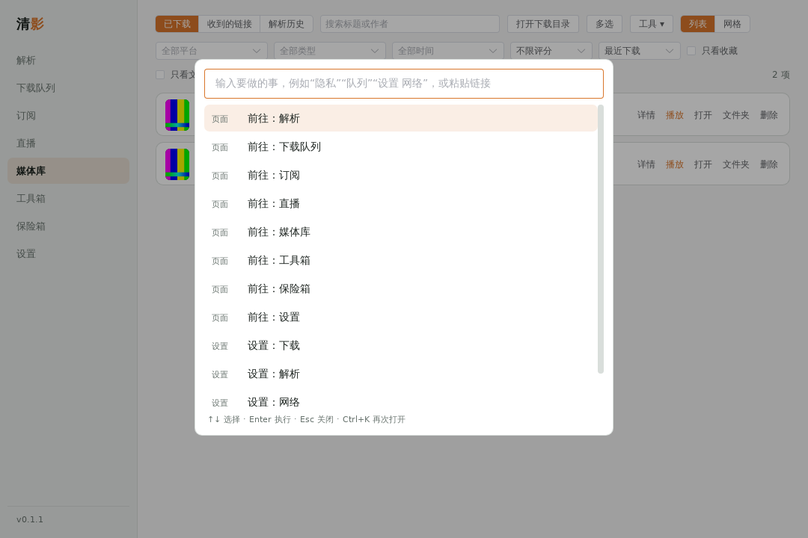
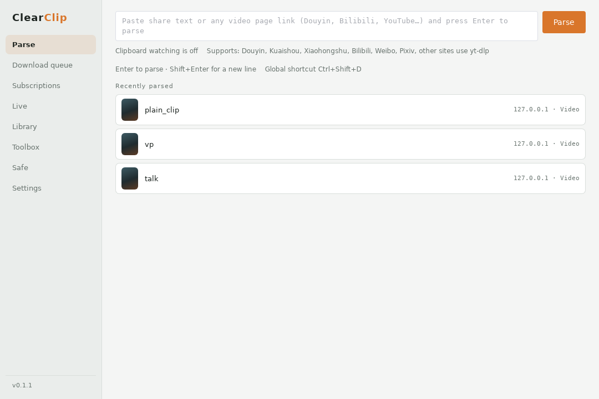

# 桌面体验

## 首次引导

第一次启动（同意使用说明之后）会出现 4 步引导：界面语言、保存位置、yt-dlp 和 ffmpeg 组件（可以一键安装，也可以跳过）、剪贴板监听等常用选项，最后列出手机发送、应用锁、登录账号这几个可以逐步了解的功能。随时可以“跳过引导”，所有选项以后都能在设置里改。升级前就已经在用的用户不会再看到引导。

## 命令面板（Ctrl+K）

在任何页面按 `Ctrl+K`（macOS 按 `Cmd+K`）打开，输入几个字就能：

- 跳到任何页面或设置页（“设置：网络”“设置：安全与隐私”……）；
- 暂停全部 / 继续全部下载、清除已完成的任务、打开下载文件夹；
- 立即锁定、开启 / 关闭隐私模式、开启 / 关闭省流量模式；
- 切换主题、开启 / 关闭悬浮拖拽窗、检查更新；
- 粘贴一个链接直接解析；输入别的文字可以“在媒体库搜索”。

匹配按“输入的字依次出现在命令名里”，也认拼音和英文关键词（如 `jiexi`、`queue`）。`↑↓` 选择，`Enter` 执行，`Esc` 关闭。

## 悬浮拖拽窗

“设置 → 通用 → 悬浮拖拽窗”（或命令面板）打开桌面上的一个小窗口，始终在最前面：**把浏览器里的链接（或选中的一段带链接的文字）拖进去就开始下载**；也可以点一下它再按 `Ctrl+V` 粘贴；有任务时显示任务数和总速度；双击回到主窗口，点 × 关闭。可以拖动标题区域移动位置。应用锁锁定时它会隐藏。

## 任务详情

下载队列里每个任务的“详情”打开侧栏，用来排查问题：

- **基本信息**：状态、进度、来源链接、保存位置、创建 / 结束时间、后处理选项、下载中的临时文件；
- **失败原因**和建议的下一步（需要登录、网络、地区限制、磁盘……）；
- **原始请求**：每个输入的协议（HTTP 直链 / m3u8 分片 / yt-dlp）、网络出口（直连 / 系统代理 / 自定义代理）、实际发送的请求头。Cookie 和令牌只显示长度，链接里的 `token`、`sign` 之类参数会缩短，所以可以放心复制给别人排查；
- **过程记录**：带时间的步骤——开始、网络错误和第几次重试、下载地址过期后重新解析、合并 / 转码 / 内嵌字幕、检查文件、失败原因、完成。只保存在内存里，退出清影后清空。“复制全部”把以上内容整理成一段文字。

## 托盘

托盘图标悬停时显示总下载速度和任务数（例如 `清影 · ↓ 3.2 MB/s · 2 个下载中，1 个等待`，只有数字，不含标题）；macOS 上速度同时显示在图标旁边。托盘菜单有“显示主窗口 / 解析剪贴板 / 监听剪贴板 / 锁定 / 退出”。

## 界面语言

“设置 → 通用 → 界面语言”可以在中文和 English 之间立即切换（引导里也能选）。

英文由机器翻译整理，覆盖界面里的 1500 多条文字和托盘菜单、系统通知的标题；限制：

- 较长的提示、软件返回的错误消息（如下载失败的具体原因）、作品标题等动态内容仍是中文；
- 没有做日语。

实现方式：界面源码里写的是中文，英文模式下在页面上把文字换成 `src/i18n/en.ts` 里的译文。新增界面文字后运行 `npm run i18n` 会列出还没有译文的条目，往 `en.ts` 里补一行即可；没有译文的地方保持中文。

## 网络

### 限速计划

“设置 → 下载 → 限速计划与省流量”里可以加多个时段（选星期、开始和结束时间、限速 KB/s，0 表示这个时段不限速），时段内用这里的限速，其它时间用“全局限速”；多个时段重叠时取最先匹配的，结束早于开始表示跨过午夜。每 20 秒刷新一次生效值，正在下载的任务马上按新限速走。

### 省流量模式

用于手机热点等按流量计费的网络，打开后：下载并发降为 1、分段数最多 2、默认画质改为“省空间”（不超过 720P）、订阅更新不自动下载、不自动上传、不自动调用 AI；已经排队的任务不受影响。开关在同一处，也在命令面板里。清影不会自动检测计量网络，需要自己打开。

### 线路测速

“设置 → 网络”里输入一个地址（最好是视频文件或这个网站上较大的资源），对直连、系统代理和每个自定义代理，各下载这个地址开头的一小段（最多 1.5 MB / 6 秒），比较首字节耗时和速度，标出最快的，点“设为此网站的出口”就加一条这个网站的分流规则。

## 安装包

发布页提供：Windows x64（安装版 / 便携版）、Windows ARM64（实验性）、macOS（Apple 芯片和 Intel 通用的一个 dmg）、Linux（AppImage / deb / rpm）。流水线上 macOS 通用包和 Windows ARM64 在 `desktop-ci` 里有编译检查。Flatpak / Snap 没有做。
